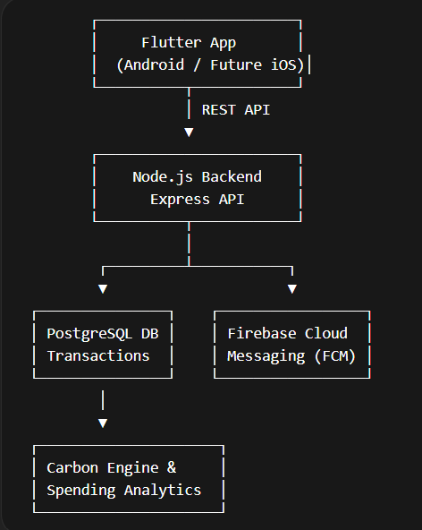
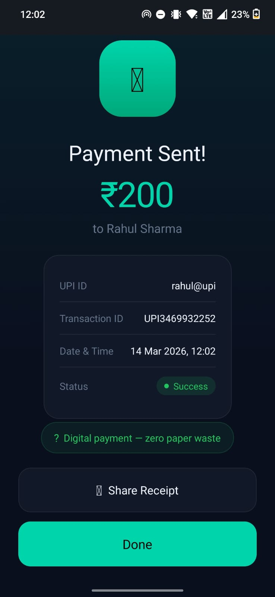
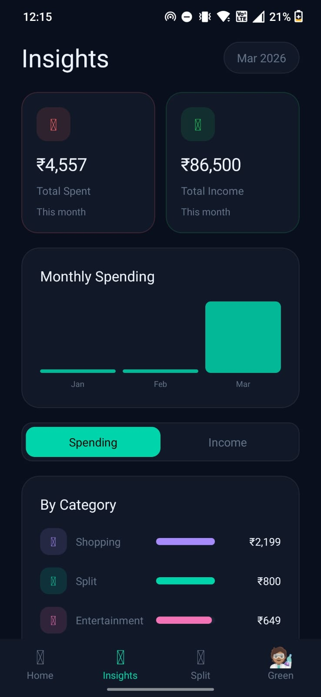
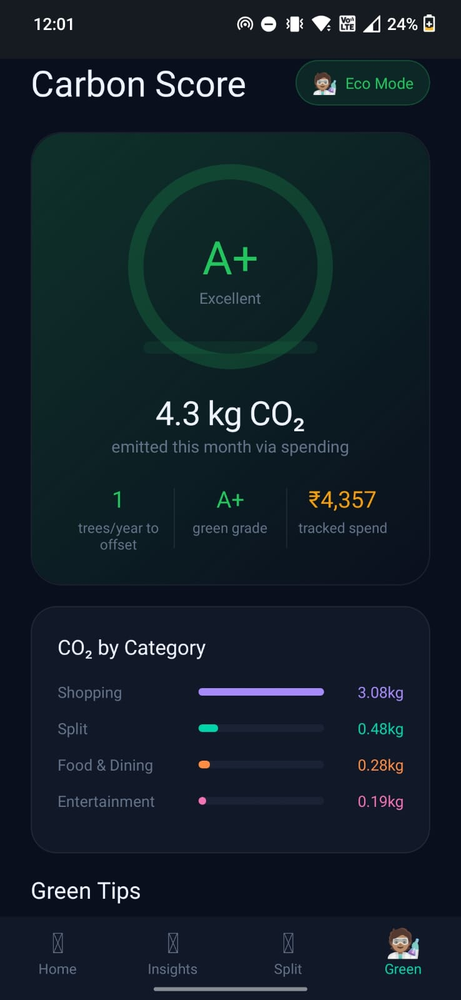

# 💸 PAY KARO — "Pay Smart. Track Smart. Live Green."

 <!-- You can replace this with a nice horizontal banner if you have one -->

**PAY KARO** is a next-generation fintech application that goes beyond traditional payments. It combines seamless UPI transactions with deep financial insights, easy expense splitting, and a unique **Carbon Footprint Tracker** to help users understand the environmental impact of their spending.

This repository contains the complete source code for the **Web SPA (Single Page Application)** frontend, the **Node.js/Express** backend, and the **Flutter** mobile app structure.

---

## ✨ Key Features

### 💳 Smart Payments
- **Send & Receive Money:** Instant UPI transfers with a premium, glassmorphic UI.
- **Scan & Pay:** QR code scanning for quick merchant payments.
- **Transaction History:** Clean, categorized feed of recent activity.

### 📊 Spending Insights
- **Monthly Analytics:** Canvas-drawn responsive charts showing spending trends.
- **Category Breakdown:** See exactly where your money goes (Food, Travel, Shopping, etc.).
- **Income vs. Spend:** Track your total balance and monthly limits.

### 👥 Split Payments
- **Create Groups:** Easily split bills for trips, dinners, or shared expenses.
- **Track Pending:** See exactly who has paid and who still owes.
- **Reminders:** Send quick nudges to pending members.

### 🌍 Carbon Footprint Tracker (Eco Mode)
- **Real-time Carbon Score:** An animated ring gauge that tracks your monthly green score.
- **Category Impact:** See how many kgs of CO₂ your lifestyle choices emit.
- **Eco Tips:** Actionable suggestions to offset your carbon footprint.

---

## 🎨 The Web Frontend

The web application is built as a pure, lightweight **Single Page Application (SPA)** with zero external framework dependencies.

- **Vanilla HTML/CSS/JS:** Built for maximum speed and minimal bundle size.
- **Premium Dark Fintech UI:** Features CSS custom properties (70+ tokens), glassmorphism (`backdrop-filter: blur`), and a vibrant accent palette.
- **Fully Responsive:** Uses fluid typography and dynamic layouts to scale perfectly from small mobile screens to large desktop monitors.
- **Smooth Animations:** Staggered entry animations, rippling buttons, and dynamically drawn canvas charts.

---

## 🏗 System Architecture



### 🛠 Tech Stack

**Web Frontend:**
- HTML5, CSS3, Vanilla JavaScript
- HTML5 Canvas API (Charts & Ring gauges)

**Backend:**
- Node.js + Express
- JWT Authentication

**Database:**
- PostgreSQL (Structured Data)
- Firebase / Firestore (Auth & NoSQL Data)

**Mobile (In Progress):**
- Flutter

---

## 🚀 Getting Started

### 1. Web Application (Frontend)
No build step required! Simply serve the root folder.
```bash
# Clone the repository
git clone https://github.com/Mohit-Rocky-25/PAY-KARO.git

# Navigate to the folder
cd PAY-KARO

# Run a local live server
npx live-server
```
Navigate to `http://localhost:8080` in your browser.

### 2. Backend API
```bash
cd pay__karo/backend
npm install

# Setup your .env file
cp .env.example .env

# Start the server
npm start
```

### 3. Mobile App (Flutter)
```bash
cd pay__karo/flutter
flutter pub get
flutter run
```

---

## 📱 Mobile App Screenshots

<p align="center">
  
  
  
  
  
</p>

---

## 👨‍💻 Authors

- **Team ShadowX** (Original Mobile App Design)
- **Mohit-Rocky-25** (Web Application & Backend Implementation)
